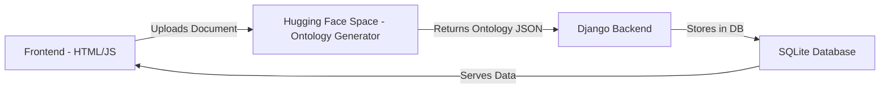

# 🧠 Knowledge Graph Builder

A complete web-based Knowledge Graph Builder that allows users to upload documents, automatically generate ontologies using a Hugging Face Space, and visualize knowledge graphs through a Django + HTML interface.

This system integrates with a custom Hugging Face Space — **Ontology Generator** — which extracts entities and relationships from uploaded documents and sends them back to the backend for storage and visualization.

---

## 🚀 Features

✅ Upload documents (PDF, TXT, DOCX, etc.)  
✅ Automatic ontology generation using Hugging Face Space  
✅ Django backend with REST API and database storage  
✅ HTML/CSS/JS frontend served directly from Django (no React, no HTTPS)  
✅ Graph visualization support  
✅ SQLite database by default (simple and portable)  
✅ One-command run setup (`python manage.py runserver`)

---

## 🧠 System Architecture


---

## 🏗️ Folder Structure
```
Knowledge-Graph-Builder/
│
├── django_backend/           # Django backend (main logic)
│   ├── manage.py
│   ├── db.sqlite3
│   ├── requirements.txt
│   ├── ontologies/             # Your Django app (models, views, urls, serializers)
│   └── settings.py
│
├── ontologies/
│── frontend/                 # HTML files (frontend)
│     ├── index.html          # Auto-generated ontology JSON/YAML files
├── faiss.index              
├── Procfile
├── .gitignore
└── README.md
```

---

## ⚙️ Prerequisites

| Tool | Version | Description |
|------|---------|-------------|
| Python | 3.8+ | Required for Django backend |
| pip | Latest | Python package manager |
| Git | Any | Version control |

> **Note:** No Node.js or HTTPS setup required. Frontend is served directly by Django.

---

## 🧠 Hugging Face Space Integration

### 🔗 Space URL:
[**Ontology Generator**](https://huggingface.co/spaces/VivanRajath/Ontology-Generator)

### 🔍 How It Works

1. Frontend uploads a document to the Hugging Face Space using a POST request.
2. The HF Space extracts entities, relationships, and ontology structure using NLP.
3. The Space returns a JSON response like:
```json
{
  "classes": ["Person", "Organization"],
  "relations": [
    {"Person": "works_for", "Organization": "OpenAI"}
  ],
  "attributes": {"Person": ["name", "age"], "Organization": ["industry"]}
}
```

4. The Django backend stores this ontology in `ontologies/` and the database.
5. The frontend visualizes the ontology as a Knowledge Graph.

---

## 🚀 Installation (Step-by-Step)

### 1️⃣ Clone the Repository
```bash
git clone https://github.com/VivanRajath/Knowledge-Graph-Builder.git
cd Knowledge-Graph-Builder/django_backend
```

### 2️⃣ Create a Virtual Environment

**Windows:**
```bash
python -m venv venv
venv\Scripts\activate
```

**Mac/Linux:**
```bash
python3 -m venv venv
source venv/bin/activate
```

### 3️⃣ Install Dependencies
```bash
pip install --upgrade pip
pip install -r requirements.txt
```

### 4️⃣ Apply Database Migrations
```bash
python manage.py makemigrations
python manage.py migrate
```

### 5️⃣ Create a Superuser (for Admin Panel)
```bash
python manage.py createsuperuser
```

Enter your username, email (optional), and password.

### 6️⃣ Run the Server
```bash
python manage.py runserver
```

✅ **App runs at** → `http://127.0.0.1:8000/`

> No HTTPS or second server needed — Django serves everything.

---

## 🌐 Access Points

| Component | URL | Description |
|-----------|-----|-------------|
| Frontend (Upload UI) | `http://127.0.0.1:8000/` | Upload and visualize ontologies |
| Admin Panel | `http://127.0.0.1:8000/admin` | Manage ontology data |
| API Endpoints | `http://127.0.0.1:8000/api/` | Access ontology data via REST |

---

## 📤 Document Upload Flow

1. User uploads a file using the HTML frontend (`index.html` or `upload.html`):
```javascript
const formData = new FormData();
formData.append("file", document.getElementById("fileInput").files[0]);

const response = await fetch("https://huggingface.co/spaces/VivanRajath/Ontology-Generator/api/predict", {
    method: "POST",
    body: formData
});
const result = await response.json();
```

2. The ontology JSON result is sent to the Django backend:
```javascript
fetch("/api/ontology/", {
    method: "POST",
    headers: { "Content-Type": "application/json" },
    body: JSON.stringify(result)
});
```

3. Django saves it in the database and `/ontologies/` directory.
4. The frontend visualizes the ontology graph.

---

## ⚙️ Configuration

| Setting | File | Description |
|---------|------|-------------|
| Hugging Face Space URL | `script.js` | Update `fetch()` URL if the Space name changes |
| Database | `settings.py` | Default: SQLite (`db.sqlite3`) |
| Static/Template Paths | `settings.py` | Must point to `/static/` and `/templates/` |
| Ontology Storage | `/ontologies/` | Stores generated ontology files |

---

## 🧰 Common Commands

| Purpose | Command |
|---------|---------|
| Run server | `python manage.py runserver` |
| Make migrations | `python manage.py makemigrations` |
| Apply migrations | `python manage.py migrate` |
| Create admin | `python manage.py createsuperuser` |
| Collect static files | `python manage.py collectstatic` |

---

## 🧪 Example Ontology Output

**Input Document:**
```
"Alice works at OpenAI in San Francisco."
```

**Ontology Generated:**
```json
{
  "classes": ["Person", "Organization", "Location"],
  "relations": [
    {"Person": "works_for", "Organization": "OpenAI"},
    {"Organization": "located_in", "Location": "San Francisco"}
  ]
}
```

---

## 💡 Visualization

You can visualize ontologies using **Vis.js**, **D3.js**, or **Cytoscape.js** inside `graph.html`.

**Example:**
```html
<div id="graph"></div>
<script src="https://unpkg.com/vis-network/standalone/umd/vis-network.min.js"></script>
<script>
const data = {
  nodes: new vis.DataSet([{id: 1, label: 'Alice'}, {id: 2, label: 'OpenAI'}]),
  edges: new vis.DataSet([{from: 1, to: 2, label: 'works_for'}])
};
const network = new vis.Network(document.getElementById('graph'), data, {});
</script>
```

---

## 👤 Author

**Developed by:** Vivan Rajath  
🔗 **Ontology Generator HF Space:** [https://huggingface.co/spaces/VivanRajath/Ontology-Generator](https://huggingface.co/spaces/VivanRajath/Ontology-Generator)

---

## 📄 License

Licensed under the **MIT License** — free to use and modify.

---

## ✅ Quick Summary (Pin-to-Pin)

| Step | Command |
|------|---------|
| Clone repo | `git clone https://github.com/VivanRajath/Knowledge-Graph-Builder.git` |
| Go to backend | `cd Knowledge-Graph-Builder/django_backend` |
| Create venv | `python -m venv venv` |
| Activate venv | `venv\Scripts\activate` (Windows) or `source venv/bin/activate` (Linux/Mac) |
| Install deps | `pip install -r requirements.txt` |
| Migrate DB | `python manage.py migrate` |
| Create superuser | `python manage.py createsuperuser` |
| Run server | `python manage.py runserver` |
| Upload doc | Frontend → Hugging Face → Ontology returned |
| View UI | `http://127.0.0.1:8000/` |

---

## 🛠️ Tech Stack


---

**⭐ If you find this project useful, please give it a star!**
